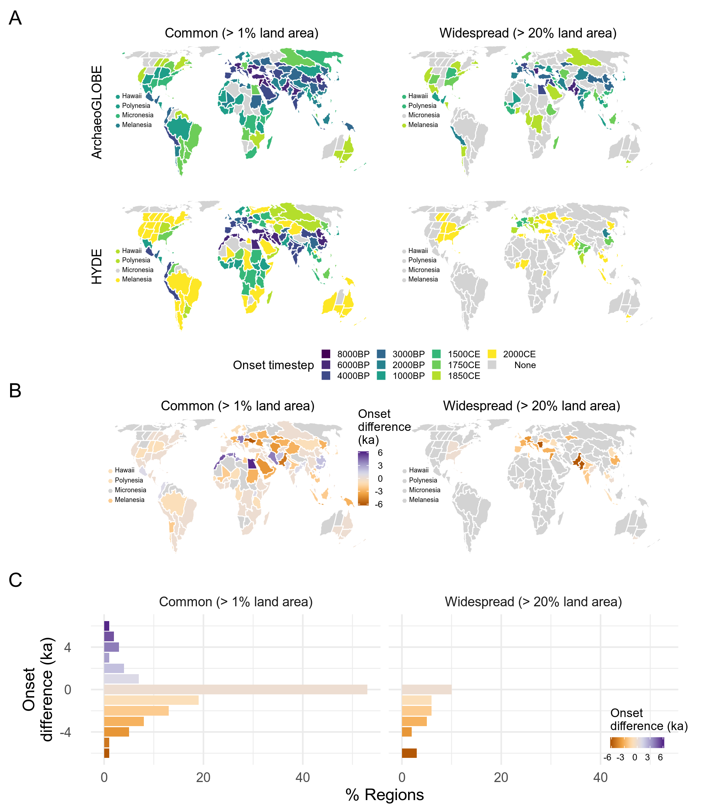

```{r setup, include=FALSE}
knitr::opts_chunk$set(echo = TRUE, 
                      message = FALSE, 
                      warning = FALSE, 
                      cache = FALSE)
```

Analysis code for the ArchaeoGLOBE project. This notebook was used to produce all the analyses and figures in the publication. All data are downloaded from their associated online repositories prior to the analysis.

# Setup

Import packages needed for analysis. We'll use packages from the `tidyverse`, such as `readr`, `dplyr`, and `ggplot2` for data import, processing, and plotting. We'll also use `mgcv` for fitting nonlinear trends to the data. We'll use the `sf` and `raster` packages to handle spatial data and plotting. The `dataverse` and `osfr` packages allows us to pull the raw survey data and precomputed analysis files from their online repositories. Finally, we'll use `patchwork` (installed from GitHub) to combine multiple ggplots in the same image.

```{r, message = FALSE}
library(raster)
library(tidyverse)
library(mgcv)
library(sf)
library(ggplot2)
library(dataverse)

#install patchwork and osfr from github if needed
#devtools::install_github('thomasp85/patchwork')
library(patchwork)
# devtools::install_github('centerforopenscience/osfr')
library(osfr)
```

## Data import

Download all data necessary for the analysis and import into R. By default, the code chunks that actually download the data are hidden here, so please refer to the source .rmd document for the relevant code.

Read in the latest version of the ArchaeoGLOBE database and the consensus assessment from the Dataverse repository. Refer to the source .rmd document for the code to download the shapefiles from the Dataverse repository.

```{r, dataverse-database, echo = FALSE}
Sys.setenv('DATAVERSE_SERVER' = 'dataverse.harvard.edu')

# get data frame of files on dataverse
ArchaeoGLOBE_Data_DOI <- 'doi:10.7910/DVN/CNCANQ'
ArchaeoGLOBE_Data_df <- get_dataset(ArchaeoGLOBE_Data_DOI)

# Only download the file we need here
ArchaeoGLOBE_Data_df_files <- ArchaeoGLOBE_Data_df$files[
  grepl('ARCHAEOGLOBE_PUBLIC_DATA|ARCHAEOGLOBE_CONSENSUS_ASSESSMENT', 
        ArchaeoGLOBE_Data_df$files$filename), ]

# read into local dir
walk(ArchaeoGLOBE_Data_df_files$label,
     ~get_file(.x, ArchaeoGLOBE_Data_DOI) %>% 
       writeBin(paste0('data/raw-data/', .x)))
```

```{r, load-data}
archaeoglobe <- read_csv('data/raw-data/ARCHAEOGLOBE_PUBLIC_DATA.tab')
consensus <- read_csv('data/raw-data/ARCHAEOGLOBE_CONSENSUS_ASSESSMENT.tab')
```

Repeat for the archaeological regions shapefile. We'll use the "simplified regions" shapefile for plotting purposes, and the original shapefile for the ArchaeoGLOBE -- HYDE -- kk10 comparison at the end of this notebook. Refer to the source .rmd document for the code to download the shapefiles from the Dataverse repository.

```{r, dataverse-shapefile-download, echo = FALSE}
ArchaeoGLOBE_Regions_DOI <- 'doi:10.7910/DVN/CQWUBI'

# get data frame of files on DV
ArchaeoGLOBE_Regions_df <- get_dataset(ArchaeoGLOBE_Regions_DOI) 

# just download the shapefiles we want
ArchaeoGLOBE_Regions_df_files <- ArchaeoGLOBE_Regions_df$files[
  ArchaeoGLOBE_Regions_df$files$filename %in% 
    c('ArchaeoGLOBE_Simplified_Regions.zip','ArchaeGLOBE_Regions.zip'), ]

# read into local dir
walk(ArchaeoGLOBE_Regions_df_files$label,
    ~get_file(.x, ArchaeoGLOBE_Regions_DOI) %>% 
      writeBin(paste0('data/raw-data/', .x)))

# unzip the shapefiles
unzip('data/raw-data/ArchaeoGLOBE_Simplified_Regions.zip', 
      overwrite = TRUE,
      exdir = 'data/raw-data/ArchaeoGLOBE_Simplified_Regions')
unzip('data/raw-data/ArchaeGLOBE_Regions.zip', 
      overwrite = TRUE,
      exdir = 'data/raw-data/ArchaeoGLOBE_Regions')
```

```{r, read-shp}
# read into the current environment
regions <- st_read('data/raw-data/ArchaeoGLOBE_Simplified_Regions/ArchaeoGLOBE_Simplified_Regions.shp', 
          quiet = TRUE) %>%
  # add labels for just the islands, will make plotting easier in the future
  mutate(region_label = replace(Archaeo_RG, 
                                !(Archaeo_RG %in% c('Hawaii','Polynesia','Micronesia','Melanesia')), NA))

regions_hyde <- st_read('data/raw-data/ArchaeoGLOBE_Regions/ArchaeGLOBE_Regions.shp', 
          quiet = TRUE) %>%
  # reproject to match HYDE data
  st_transform('+proj=longlat +datum=WGS84 +no_defs +ellps=WGS84 +towgs84=0,0,0')
```

# Exploratory visualization

Before running any analyses, let's look at the data. How many responses do we have per region?

```{r}
response_counts <- archaeoglobe %>% 
  group_by(REGION_ID) %>%
  count %>%
  mutate(n10 = replace(n, n > 10, 10))
```

```{r, fig.width = 6.5, fig.height = 5.5, echo = FALSE}
a <- regions %>%
  left_join(response_counts, by = c('Archaeo_ID' = 'REGION_ID')) %>%
  ggplot() +
  geom_sf(aes(fill = n10), size = .3, color = 'white') +
  scale_fill_viridis_c(name = 'Contributors', guide = 'legend', breaks = seq(2, 10, 2), labels = c(seq(2, 8, 2), '10+')) +
  geom_sf_text(aes(label = region_label), nudge_x = 500000, size = 2.5, hjust = 0) +
  coord_sf(datum = NA) +
  theme_void() +
  theme(legend.position='bottom')

b <- ggplot(response_counts, aes(n, group = n)) +
  geom_bar(aes(fill = n10)) +
  scale_fill_viridis_c(guide = 'none') +
  theme_classic() +
  labs(x = 'Contributors', y = 'Regions')

a + b + plot_layout(ncol = 1, heights = c(2,1)) + plot_annotation(tag_levels = 'A')
ggsave('figures/1_response_distribution.png', width = 6.5, height = 5.5)
```

How many published archaeological excavations are estimated for each region?

```{r}
# a function for calculating the mode, from https://stackoverflow.com/a/46846474
calculate_mode <- function(x) {
  uniqx <- unique(x)
  uniqx[which.max(tabulate(match(x, uniqx)))]
}

# use this vector to order the RN_SITES variable by increasing number of sites
site_order <- c('< 50', '50-249', '250-499', '500-999', '> 1000')

# find the modal response for the number of published excavations in each region
site_counts <- archaeoglobe %>%
  select(REGION_ID, RN_SITES) %>%
  group_by(REGION_ID) %>%
  summarise(sites = calculate_mode(RN_SITES)) %>%
  mutate(sites = ordered(sites, levels = site_order))
```

```{r echo = FALSE}
sites_plot <- regions %>%
  left_join(site_counts, by = c('Archaeo_ID' = 'REGION_ID')) %>%
  ggplot() +
  geom_sf(aes(fill = sites), size = .3, color = 'white') +
  scale_fill_viridis_d(name = '', guide = 'legend') +
  geom_sf_text(aes(label = region_label), nudge_x = 500000, size = 2.5, hjust = 0) +
  labs(subtitle = '         Published Excavations') + # extra spaces move the title to the right a bit, needed for multipanel plot below
  coord_sf(datum = NA) +
  theme_void() +
  theme(legend.position = 'bottom')

sites_plot
```
    
## Consensus Assessment

Plot the consensus assessment data for each land-use type.
```{r, echo = FALSE}
# make the consenus data easier to plot
cons_plots <- consensus %>%
  gather(time_step, level, FHG_10KBP:URBAN_1850CE) %>%
  separate(time_step, c('type', 'time_step')) %>%
  mutate(time_step = fct_relevel(time_step, c('10KBP', '8KBP', '6KBP', '4KBP', '3KBP', '2KBP', '1KBP', '1500CE', '1750CE', '1850CE')),
         time_step = fct_recode(time_step, `10,000 BP` = '10KBP', `10,000 BP` = '10kbp',
                                `8,000 BP` = '8KBP', `8,000 BP` = '8kbp',  
                                `6,000 BP` = '6KBP', `6,000 BP` = '6kbp',
                                `4,000 BP` = '4KBP', `4,000 BP` = '4kbp',
                                `3,000 BP` = '3KBP', `3,000 BP` = '3kbp', 
                                `2,000 BP` = '2KBP', `2,000 BP` = '2kbp',
                                `1,000 BP` = '1KBP', `1,000 BP` = '1kbp', 
                                `1500 CE` = '1500CE', `1750 CE` = '1750CE', `1850 CE` = '1850CE')) %>%
      left_join(regions, ., by = c('Archaeo_ID' = 'Region'))
```

```{r, fig.height=12, fig.width = 8,echo=FALSE}
cons_plots %>%
  filter(str_detect(type, 'FHG')) %>%
  mutate(level = as.ordered(fct_relevel(level, c('None', 'Minimal', 'Common', 'Widespread'))),
         Prevalence = fct_recode(level, `Minimal (<1%)` = 'Minimal', `Common (1-20%)` = 'Common', `Widespread (>20%)` = 'Widespread')) %>%
  ggplot() +
  geom_sf(aes(fill = Prevalence), size = .3) +
  facet_wrap(~time_step, ncol = 2) +
    geom_sf_text(aes(label = region_label),nudge_x = 500000, size =2.15, hjust = 0) +
  scale_fill_brewer(palette = 'BuGn') +
  ggtitle('Foraging/Hunting/Gathering', 'Consensus Assessment') +
  coord_sf(datum = NA) +
  theme_void() +
  theme(legend.position = 'bottom')

ggsave('figures/S1_FHG_consensus.png', height = 12, width = 8)
```

```{r, fig.height=12, fig.width = 8,echo=FALSE}
cons_plots %>%
  filter(str_detect(type, 'EXAG')) %>%
  mutate(level = as.ordered(fct_relevel(level, c('None', 'Minimal', 'Common', 'Widespread'))),
         Prevalence = fct_recode(level, `Minimal (<1%)` = 'Minimal', `Common (1-20%)` = 'Common', `Widespread (>20%)` = 'Widespread')) %>%
  ggplot() +
  geom_sf(aes(fill = Prevalence), size = .3) +
  facet_wrap(~time_step, ncol = 2) +
    geom_sf_text(aes(label = region_label),nudge_x = 500000, size =2.15, hjust = 0) +
  scale_fill_brewer(palette = 'PuBu') +
  ggtitle('Extensive Agriculture', 'Consensus Assessment') +
  coord_sf(datum = NA) +
  theme_void() +
  theme(legend.position = 'bottom')

ggsave('figures/S2_EXAG_consensus.png', height = 12, width = 8)
```

```{r, fig.height=12, fig.width = 8,echo=FALSE}
cons_plots %>%
  filter(str_detect(type, 'INAG')) %>%
  mutate(level = as.ordered(fct_relevel(level, c('None', 'Minimal', 'Common', 'Widespread'))),
         Prevalence = fct_recode(level, `Minimal (<1%)` = 'Minimal', `Common (1-20%)` = 'Common', `Widespread (>20%)` = 'Widespread')) %>%
  ggplot() +
  geom_sf(aes(fill = Prevalence), size = .3) +
  facet_wrap(~time_step, ncol = 2) +
    geom_sf_text(aes(label = region_label),nudge_x = 500000, size =2.15, hjust = 0) +
  scale_fill_brewer(palette = 'BuPu') +
  ggtitle('Intensive Agriculture', 'Consensus Assessment') +
  coord_sf(datum = NA) +
  theme_void() +
  theme(legend.position = 'bottom')

ggsave('figures/S3_INAG_consensus.png', height = 12, width = 8)
```

```{r, fig.height=12, fig.width = 8,echo=FALSE}
cons_plots %>%
  filter(str_detect(type, 'PAS')) %>%
  mutate(level = as.ordered(fct_relevel(level, c('None', 'Minimal', 'Common', 'Widespread'))),
         Prevalence = fct_recode(level, `Minimal (<1%)` = 'Minimal', `Common (1-20%)` = 'Common', `Widespread (>20%)` = 'Widespread')) %>%
  ggplot() +
  geom_sf(aes(fill = Prevalence), size = .3) +
  facet_wrap(~time_step, ncol = 2) +
    geom_sf_text(aes(label = region_label),nudge_x = 500000, size =2.15, hjust = 0) +
  scale_fill_brewer(palette = 'Oranges') +
  ggtitle('Pastoralism', 'Consensus Assessment') +
  coord_sf(datum = NA) +
  theme_void() +
  theme(legend.position = 'bottom')

ggsave('figures/S4_PAS_consensus.png', height = 12, width = 8)
```

```{r, fig.height=12, fig.width = 8,echo=FALSE}
cons_plots %>%
  filter(str_detect(type, 'URBAN')) %>%
  mutate(Presence = as.ordered(fct_relevel(level, c('Absent', 'Split', 'Present')))) %>%
  ggplot() +
  geom_sf(aes(fill = Presence), size = .3) +
  facet_wrap(~time_step, ncol = 2) +
    geom_sf_text(aes(label = region_label),nudge_x = 500000, size =2.15, hjust = 0) +
  scale_fill_manual(values = c('#f0f0f0', '#feb24c', '#f03b20')) +
  ggtitle('Urban Centers', 'Consensus Assessment') +
  coord_sf(datum = NA) +
  theme_void() +
  theme(legend.position = 'bottom')

ggsave('figures/S5_URBAN_consensus.png', height = 12, width = 8)
```

# GAMM Trends

Here we use Generalized Additive Models (GAMs), a flexible form of nonlinear regression model capable of fitting smooth, time-varying trends to the ordered categorical ArchaeoGLOBE response data. We model ordered categorical data using a latent variable following a logistic distribution. The model identifies a series of cut points, which correspond the the probabilities of the latent variable falling within each of our categories.

We fit two sets of trends. One trend is fitted to all the data simultaneously, representing the global trend across all archaeological regions. Then we fit region-level trends, which represent the deviation of each region from the global trend. By penalizing the "wiggliness" of the trend lines, we allow regional trends that don't significantly deviate from the global trend to be penalized to 0, effectively reducing that particular region to the global trend. This is a form of partial pooling, allowing the model to share information between groups and in so doing make the results less sensitive to regions with exceptionally low response rates.

After fitting the model, we can extract the region-specific trends, use a k-means clustering algorithm to group together regions with similar trends, and map the results. We repeat this analysis for both self-reported expertise and perceived data quality.

## Analysis functions

Define some analysis functions that we'll be using repeatedly in the analysis, so that we don't have to keep copying and pasting the same lines of code.

This function subsets the data to highlight a variable of interest, and converts it from a wide to a long "tidy" format to make analysis and plotting easier.

```{r}
preprocess <- function(prefix, categories){
  archaeoglobe %>% # start with the full ArcheoGlobe data
    # drop columns not related to the variable of interest
    select(c(CONTRIBUTR:LAND_AREA, starts_with(prefix))) %>%
    gather(time, value, starts_with(prefix)) %>% # one value per row
    mutate(time = parse_number(time) * -1, # convert time period labels to years
           value = ordered(value, levels = categories),
           cat_num = as.numeric(value)) %>%
    mutate_if(is.character, as.factor) # convert characters to factors
}
```

This function takes a data frame produced by the above function and fits GAM to the global trend and local deviations for each region, accounting for inter-observer variability. This function takes as arguments a preprocessed data frame containing time slices, regions, contributors, and the ordered categorical response variable transformed to a numeric vector. 

```{r}
cores <- max(parallel::detectCores() / 2, 1) # physical cores for parallelization
cl <- parallel::makeCluster(cores)

fit_gam <- function(x, n_cats){
  bam(cat_num ~ 
        # this spline is for the global trend
        s(time, bs = 'cr', m = 2) + 
        # region-specific trends. bs = 'ts' and m = 1 
        # help penalize deviation from the global model
        s(time, by = REGION_LAB, bs = 'cs', m = 1) + 
        # add back in region-specific intercepts
        REGION_LAB  +
        # model contributor as a random effect
        s(CONTRIBUTR, bs = 're'),
      data = x, # data frame to analyize
      family = ocat(R = n_cats), # ordered categorical with n levels
      # final 3 arguments just speed up the model fitting
      method = 'fREML',
      discrete = TRUE,
      cluster = cl)
}
```

This function extracts the estimated trends for each region, incorporating the global and regional splines as well as the region and contributor specific intercepts. Then it clusters these trends into 6 discrete clusters using k-means. The choice of 6 clusters is somewhat arbitrary, and is made simply based on visual comparisons of different cluster solutions with the goal of ensuring visually interpretable results.

```{r}
extract_trends <-function(mod, n_clusters = 6){
  set.seed(1000) # set seed for reproducability of clusters
  archaeoglobe %>% # create dummy data for prediction in the following lines
    select(REGION_LAB) %>%
    group_by(REGION_LAB) %>%
    slice(1) %>%
    slice(rep(1:n(), each = 198)) %>%
    ungroup %>%
    mutate(time = rep_len(seq(-10000, -150, 50), n()),
           CONTRIBUTR = 'CYRBU') %>% # select an arbitrary contributor
    mutate(preds = predict(mod, .)) %>% # estimate trend lines
    mutate(preds = plogis(preds)) %>% # transform responses to [0,1] scale
    spread(time, preds) %>%
    # next is the actual kmeans clustering code
    mutate(cluster = kmeans(.[,-c(1,2)], n_clusters, iter.max = 100, nstart = 100)$cluster)
}
```

## Analysis

Now we use the functions defined above to estimate trends in ArchaeoGLOBE data. For convenience, first define a data frame that lists the prefixes of the variables we are interested in (e.g. "EXP" for expertise) and the levels of the ordered factors associated with each variable. This will make it easier to quickly focus on a specific variable. The `tribble` command is simply a way to make a data frame by row rather than column, which makes the code easier to read.

```{r}
response_levels <- tribble(
  ~prefix, ~categories,
  'EXP', c('None', 'Low', 'High'),                  # Expertise
  'DQ', c('Unknown', 'Low', 'Moderate', 'Good'),    # Data Quality
  'HUNT', c('none', 'minimal (<1%)', 'common (1-20%)', 'widespread (>20%)'), 
  'EXAG', c('none', 'minimal (<1%)', 'common (1-20%)', 'widespread (>20%)'),
  'INAG', c('none', 'minimal (<1%)', 'common (1-20%)', 'widespread (>20%)'),
  'PAST', c('none', 'minimal (<1%)', 'common (1-20%)', 'widespread (>20%)'),
  'URBN', c('Absent', 'Present')
)
```

Now map each of the above functions to each variable. This allows us to run the analysis for all variables of interest in a single step, and save all the outputs in a tibble format for easy plotting. If you're running this for the first time, it should take about 40 minutes to run on a Intel NUC with a 5th-gen Intel Core i7-5557U processor and 16gb of RAM running Linux. By default, we pull pre-computed results from a repository rather than running the time consuming analysis.

```{r echo = FALSE}
# A simple type of caching...
# Do we want to run the modelling code, or
# load a previously saved result from disk, or
# download a previously saved result from a repository?
# default is not run, then check if there is a saved file, and use that, or download

rerun_time_consuming_analysis <- FALSE # FALSE means do not run the modelling code when knitting

if(rerun_time_consuming_analysis) {
  message('running the modelling code, this may take 30-50 min...')
  # go to the next chunk of code
} else {
  # check if there is a local file and if so, load it
  if(file.exists('data/derived-data/trend_dat.rda')) {
    # the file exists on the local disk, so just read it in
    message('Loading previously saved model results from disk...')
    trend_dat <- readRDS('data/derived-data/trend_dat.rda')
  } else {
  # we don't want to run the modelling code, and the result don't exist locally,
  # so download
  message('Downloading previously saved model results, takes 2-3 min...')
  trend_dat <- osf_retrieve_file('kcr2e') %>% osf_download('data/derived-data/trend_dat.rda')
  message('Loading the data downloaded from osf.io...')
  trend_dat <- readRDS('data/derived-data/trend_dat.rda')
  writeLines(paste0('trend_dat.rda downloded from https://osf.io/kcr2e/ on ', Sys.Date()), con = 'data/derived-data/README.md', sep = '')
  message('Done.')
  } 
}
```

```{r, eval = rerun_time_consuming_analysis}
trend_dat <- response_levels %>%
  mutate(data = map2(prefix, categories, ~preprocess(.x,.y)),
         n_cats = map_dbl(categories, length), 
         mod = map2(data, n_cats, fit_gam),
         trends = map(mod, extract_trends))
```

```{r eval = rerun_time_consuming_analysis, echo = FALSE}
# save to disk
saveRDS(trend_dat, file = 'data/derived-data/trend_dat.rda')

# write a note to indicate the provenance of this file
this_commit <-  git2r::revparse_single(git2r::repository('.'), "HEAD")

writeLines(paste0('trend_dat generated on ', 
                  Sys.Date() , ' from archaeoglobe.Rmd at git commit ',
                  this_commit$sha, ' made by ',
                  this_commit$author$name, ' on ',
                  this_commit$author$when, " with the message '",
                  this_commit$summary, "'"),
           con = 'data/derived-data/README.md', 
           sep = '')
message('Done.')
```

```{r eval = FALSE, echo = FALSE}
# If we have freshly produced model output, we want to 
# upload to osf.io, this needs to be done manually because we need to 
# authenticate and don't want to put our PAT in the Rmd

osf_auth('my-PAT-for-OSF') # Navigate to https://osf.io/settings/tokens/

# upload the model data
osf_retrieve_node('gcfs6') %>% 
  osf_upload(path = 'data/derived-data/trend_dat.rda', 
             overwrite = TRUE)

# upload the README
osf_retrieve_node('gcfs6') %>% 
  osf_upload(path = 'data/derived-data/README.md', 
             overwrite = TRUE)
```

## Results

First we plot out the global trends for each land use type, and compare them to the consensus estimates. Then we plot the local (regional trends) for all land use types, and map out their associated clusters. Please refer to the .rmd source file for the code to make the plots.

### Global Trends

The global trend in foraging shows constant high prevalence until around 6,000 years ago, after which there is a smooth decline until the present day when it is very rare. Mapping out the clusters reveals a clear east-west divide, which regions in Afro-eurasia seeing foraging earlier then the global mean, and regions in the Americas and Oceania seeing later peaks in foraging.

The global trends in the prevalence of pastoralism, extensive and intensive agriculture, and urbanism all follow a sigmoidal curve, which means the trend is linear on the scale of the linear predictor (the ordered categorical GAM uses a logit transform as a latent link function). This means that there is a simple increase in the probability of each land use type being prevalent over time.

```{r echo = FALSE, fig.width = 5, fig.height = 6}
global_trends <- trend_dat %>%
  select(prefix, mod) %>%
  mutate(trends = map(mod, ~plot.gam(., select = 0)[1]),
         trends = map(trends, ~.[[1]]),
         trends = map(trends, ~tibble(time = .$x, fit = c(.$fit), se = .$se))) %>%
  select(-mod) %>%
  unnest %>%
  mutate(type = recode_factor(prefix,
                              'EXAG' = 'Extensive Agriculture',
                              'INAG' = 'Intensive Agriculture',
                              'PAST' = 'Pastoralism',
                              'HUNT' = 'Foraging',
                              'URBN' = 'Urban',
                              'EXP' = 'Expertise',
                              'DQ' = 'Data Quality'),
         time = time / 1000,
         lower =  plogis(fit - 2 * se),
         upper = plogis(fit + 2 * se),
         fit = plogis(fit))

trend_colors <- c('#4daf4a', '#e41a1c', '#ff7f00', '#6a3d9a')

g1 <- global_trends %>%
  filter(prefix %in% c('HUNT','PAST','EXAG','INAG')) %>%
ggplot(aes(time, fit, group = type)) +
  geom_line(aes(color = type), size = 1.2) +
  geom_ribbon(aes(ymin = lower, ymax =  upper, fill = type), alpha = .3) +
  scale_color_manual(guide = FALSE, values = trend_colors) +
  scale_fill_manual(guide = FALSE, values = trend_colors) +
  scale_x_continuous(breaks = c(-10, -8,-6,-4,-2,0), minor_breaks = NULL) +
  scale_y_continuous(breaks = c(0,1), labels = c('None', 'Widespread'), limits = c(0,1)) +
  labs(x = 'Thousand years BP', y = 'Land-use extent\n') +
  theme_bw() +
  theme(strip.background = element_blank()) +
  facet_wrap(~type)

g2 <- global_trends %>%
  filter(prefix %in% c('EXP', 'DQ')) %>%
ggplot(aes(time, fit, group = type)) +
  geom_line(aes(color = type), size = 1.2) +
  geom_ribbon(aes(ymin = lower, ymax =  upper, fill = type), alpha = .3) +
  scale_color_discrete(guide = FALSE) +
  scale_fill_discrete(guide = FALSE) +
  scale_x_continuous(breaks = c(-10,-8,-6,-4,-2,0), minor_breaks = NULL) +
  scale_y_continuous(breaks = c(0,1), labels = c('Low', 'High'), limits = c(0,1)) +
  labs(x = 'Thousand years BP', y = 'Archaeological \nknowledge') +
  theme_bw() +
  theme(strip.background = element_blank()) +
  facet_wrap(~type)

g1 + g2 + plot_layout(ncol = 1, heights = c(2,1)) + plot_annotation(tag_levels = 'A')
```

The numerical cutpoints between the ordered categorical response levels estimated by the model vary across land-use type. This is a normal result of the ordered categorical regression, and basically means that different sources of error/uncertainty impact how contributors translate their mental models of areal extent (the latent, "real" value the regression is trying to estimate) into discrete categories across the different land use types. 

```{r cutpoints, echo = FALSE, fig.width = 6, fig.height = 4}
cutpoints_dat <- trend_dat %>%
  select(prefix, mod) %>%
  mutate(cutpoints = map(mod, ~.$family$getTheta(TRUE)),
         cutpoints = map(cutpoints , plogis)) %>%
  select(-mod)

cp1 <- global_trends %>%
  filter(prefix == 'EXAG') %>%
  ggplot(aes(time, fit, group = type)) +
  geom_hline(yintercept =c(0, cutpoints_dat[[4,2]]), linetype = 2, alpha = .5) +
  geom_line(aes(color = type), size = 1.2, color = '#4daf4a') +
  geom_ribbon(aes(ymin = lower, ymax =  upper, fill = type), alpha = .3, fill = '#4daf4a') +
  scale_x_continuous(breaks = c(-10, -8,-6,-4,-2,0), minor_breaks = NULL) +
  scale_y_continuous(breaks = c(0, cutpoints_dat[[4,2]]), minor_breaks = NULL,
                     labels = c('None', 'Minimal', 'Common', 'Widespread'), limits = c(0,1)) +
  labs(x = '', y = 'Land-use extent\n') +
  theme_bw() +
  theme(strip.background = element_blank()) +
  facet_wrap(~type)

cp2 <- global_trends %>%
  filter(prefix == 'INAG') %>%
  ggplot(aes(time, fit, group = type)) +
  geom_hline(yintercept =c(0, cutpoints_dat[[5,2]]), linetype = 2, alpha = .5) +
  geom_line(aes(color = type), size = 1.2, color = '#e41a1c') +
  geom_ribbon(aes(ymin = lower, ymax =  upper, fill = type), alpha = .3, fill = '#e41a1c') +
  scale_x_continuous(breaks = c(-10, -8,-6,-4,-2,0), minor_breaks = NULL) +
  scale_y_continuous(breaks = c(0, cutpoints_dat[[5,2]]), minor_breaks = NULL, 
                     labels = c('None', 'Minimal', 'Common', 'Widespread'), limits = c(0,1)) +
  labs(x = '', y = '') +
  theme_bw() +
  theme(strip.background = element_blank()) +
  facet_wrap(~type)

cp3 <- global_trends %>%
  filter(prefix == 'PAST') %>%
  ggplot(aes(time, fit, group = type)) +
  geom_hline(yintercept =c(0, cutpoints_dat[[6,2]]), linetype = 2, alpha = .5) +
  geom_line(aes(color = type), size = 1.2, color = '#ff7f00') +
  geom_ribbon(aes(ymin = lower, ymax =  upper, fill = type), alpha = .3, fill = '#ff7f00') +
  scale_x_continuous(breaks = c(-10, -8,-6,-4,-2,0), minor_breaks = NULL) +
  scale_y_continuous(breaks = c(0, cutpoints_dat[[6,2]]), minor_breaks = NULL, 
                     labels = c('None', 'Minimal', 'Common', 'Widespread'), limits = c(0,1)) +
  labs(x = 'Thousand years BP', y = 'Land-use extent\n') +
  theme_bw() +
  theme(strip.background = element_blank()) +
  facet_wrap(~type)

cp4 <- global_trends %>%
  filter(prefix == 'HUNT') %>%
  ggplot(aes(time, fit, group = type)) +
  geom_hline(yintercept =c(0, cutpoints_dat[[3,2]]), linetype = 2, alpha = .5) +
  geom_line(aes(color = type), size = 1.2, color =  '#6a3d9a') +
  geom_ribbon(aes(ymin = lower, ymax =  upper, fill = type), alpha = .3, fill = '#6a3d9a') +
  scale_x_continuous(breaks = c(-10, -8,-6,-4,-2,0), minor_breaks = NULL) +
  scale_y_continuous(breaks = c(0, cutpoints_dat[[3,2]]), minor_breaks = NULL, 
                     labels = c('None', 'Minimal', 'Common', 'Widespread'), limits = c(0,1)) +
  labs(x = 'Thousand years BP', y = '') +
  theme_bw() +
  theme(strip.background = element_blank()) +
  facet_wrap(~type)

cp1 + cp2 + cp3 + cp4
```

Compare the global trends to the consensus assessments. To do this, we first need to calculate the cumulative changes in land-use extent for each type.

```{r consensus_cumsum, echo = FALSE}
cumsum_landuse_regions <- consensus %>% 
  select(Region, FHG_10KBP:URBAN_1850CE) %>% 
  gather(variable, value, -Region) %>% 
  filter(value %in% c('Widespread', 'Common', 'Split', 'Present')) %>% 
  separate(variable, into = c('land_use_category', 'years_BP'), sep = '_') %>% 
  mutate(land_use_category = ifelse(str_detect(land_use_category, 'AGR'),
                                    str_replace_all(land_use_category , 
                                                    'AGR', 
                                                    'AG'),
                                    land_use_category)) %>% 
  mutate(land_use_category = case_when(
    land_use_category == 'FHG'   ~  'Foraging',
    land_use_category == 'EXAG'  ~  'Extensive Agriculture',
    land_use_category == 'INAG'  ~  'Intensive Agriculture',
    land_use_category == 'PAS'   ~  'Pastoralism',
    land_use_category == 'URBAN' ~  'Urban Centers') 
    ) %>% 
  mutate(years_BP = ifelse(str_detect(tolower(years_BP), 'kbp'), 
                           -parse_number(years_BP) * 1000,
                           ifelse(str_detect(tolower(years_BP), 'ce'), 
                           parse_number(years_BP),
                           -parse_number(years_BP)))) %>% 
  unite(land_use_consensus, 
        c('land_use_category', 
          'value'),
        sep = ' ') %>%
  complete(land_use_consensus, nesting(years_BP)) %>% 
  group_by(land_use_consensus, years_BP) %>% 
  summarise(n = n()) %>% 
  mutate(perc = n / sum(n) * 100)  %>% 
  ungroup() %>% 
  # make an ordered factor for nice plotting
  mutate(land_use_consensus = 
           fct_relevel(land_use_consensus, 
                       c('Urban Centers Split',
                         'Urban Centers Present',
                         'Extensive Agriculture Common',
                         'Extensive Agriculture Widespread',
                         'Intensive Agriculture Common',
                         'Intensive Agriculture Widespread',
                         'Pastoralism Common',
                         'Pastoralism Widespread',
                         'Foraging Common',
                         'Foraging Widespread'))) %>%
  mutate(years_BP = if_else(years_BP > 0, years_BP - 1950, years_BP),
         years_BP = years_BP / 1000)
```

```{r, echo = F, fig.width =6.5, fig.height = 8}
cs1 <- ggplot(cumsum_landuse_regions, aes(years_BP, perc, fill = land_use_consensus)) +
  geom_area(position = 'stack', color = 'black') +
  scale_fill_brewer(palette = 'Paired') +
  theme_minimal() +
  scale_x_continuous(breaks = c(-10, -8,-6,-4,-2,0)) +
  theme(panel.grid.minor = element_blank(), legend.text = element_text(size = 9),
    legend.key.size = unit(0.7, 'line'), legend.position = 'bottom') +
  guides(fill = guide_legend(title = '', nrow = 5, byrow = TRUE)) +
  labs(x = 'Thousand years BP', y = 'Percent of all regions')

cs2 <- ggplot(cumsum_landuse_regions, 
  aes(years_BP, perc, fill = land_use_consensus)) +
  geom_area(position = 'fill', color = 'black') +
  scale_fill_brewer(palette = 'Paired') +
  theme_minimal() +
  theme(panel.grid.minor = element_blank(), legend.text = element_text(size = 9),
    legend.key.size = unit(0.7, 'line'), legend.position = 'bottom') +
  guides(fill = FALSE) +
  labs(x = 'Years BP', y = 'Proportion of global land use')

cs1 / cs2 + plot_annotation(tag_levels = 'A')
```

Now plot the two analyses (GAM and consensus) together.

```{r, fig.height = 7.5, fig.width = 6}
(g1 + theme_minimal()) / cs1 + plot_annotation(tag_levels = 'A')

ggsave('figures/3_trends_global.png', height = 7.5, width = 7)
```


### Regional Trends

Now we can break down the land-use trends by region.
```{r, echo = FALSE}
plot_trends_landuse <- function(x, variable, tag){
  rt1 <- x$trends[[1]] %>%
    select(REGION_LAB, cluster) %>% # just select the columns of interest
    left_join(select(x$data[[1]], REGION_ID:REGION_LAB)) %>%
    group_by(REGION_ID) %>%
    filter(row_number() == 1) %>%
    left_join(regions, ., by = c('Archaeo_ID' = 'REGION_ID')) %>% # join to the region shapes
    ggplot() + # plot
    geom_sf(aes(fill = as.factor(cluster)), size = .3, color = 'white') +
    geom_sf_text(aes(label = region_label), nudge_x = 500000, size = 2.5, hjust = 0) +
    labs(subtitle = variable, x = '', y='', tag = tag) +
    scale_fill_brewer(palette = 'PuOr', guide = 'none') +  
    coord_sf(datum = NA) +
    theme_void()
  
  rt2 <- x$trends[[1]] %>%
    gather(time, value, '-10000':'-150') %>%
    ggplot(aes(as.numeric(time) / 1000, value, 
               group = REGION_LAB, color = as.factor(cluster))) +
    geom_line() +
    scale_color_brewer(palette = 'PuOr', guide = 'none') +
    scale_x_continuous(breaks = c(-8,-6,-4,-2), minor_breaks = NULL) +
    scale_y_continuous(breaks = c(0,1), labels = c('Low', 'High')) +
    facet_wrap(~cluster, nrow = 1, 
               labeller = labeller(cluster = 
                                     c(`1` = 'Earlier', `2` = '', `3` = '', `4` = '', `5` = '', `6` = 'Later'))) +
    labs(x = 'Thousand years BP', y = 'Extent') +
    theme_minimal() +
    theme(strip.background = element_blank())
  
  # the patchwork command that prints the multipanel plots
  (rt1 / rt2) + plot_layout(heights = c(5,1), widths = c(4,1))
}

plot_trends_knowledge <- function(x, variable, tag){
  rt1 <- x$trends[[1]] %>%
    select(REGION_LAB, cluster) %>% # just select the columns of interest
    left_join(select(x$data[[1]], REGION_ID:REGION_LAB)) %>%
    group_by(REGION_ID) %>%
    filter(row_number() == 1) %>%
    left_join(regions, ., by = c('Archaeo_ID' = 'REGION_ID')) %>% # join to the region shapes
    ggplot() + # plot
    geom_sf(aes(fill = as.factor(cluster)), size = .3, color = 'white') +
    geom_sf_text(aes(label = region_label), nudge_x = 500000, size = 2.5, hjust = 0) +
    labs(subtitle = variable, x = '', y='', tag = tag) +
    scale_fill_viridis_d(guide = 'none') +  
    coord_sf(datum = NA) +
    theme_void()
  
  rt2 <- x$trends[[1]] %>%
    gather(time, value, '-10000':'-150') %>%
    ggplot(aes(as.numeric(time) / 1000, value, 
               group = REGION_LAB, color = as.factor(cluster))) +
    geom_line() +
    scale_color_viridis_d(guide = 'none') +  
    scale_x_continuous(breaks = c(-8,-6,-4,-2), minor_breaks = NULL) +
    scale_y_continuous(breaks = c(0,1), labels = c('Low', 'High')) +
    facet_wrap(~cluster, nrow = 1, 
               labeller = labeller(cluster = c(`1` = 'Later', `2` = '', `3` = '', `4` = '', `5` = '', `6` = 'Earlier'))) +
    labs(x = 'Thousand years BP', y = '') +
    theme_minimal() +
    theme(strip.background = element_blank())
  
  # the patchwork command that prints the multipanel plots
  (rt1 / rt2) + plot_layout(heights = c(5,1), widths = c(4,1))
}
```

```{r echo = FALSE, fig.width = 12, fig.height=8}
r1 <- trend_dat[4, ] %>%
  mutate(trends = map(trends, ~mutate(.,
                                 cluster = recode_factor(cluster, 
                                 `4` = '1', `2` = '2',`1` = '3', 
                                 `5` = '4', `3` = '5', `6` = '6')))) %>%
  plot_trends_landuse('Extensive Agriculture', tag = 'A')

r2 <- trend_dat[5, ] %>%
  mutate(trends = map(trends, ~mutate(.,
                                 cluster = recode_factor(cluster, 
                                `6` = '1', `5` = '2', `3` = '3', 
                                 `1` = '4', `2` = '5', `4` = '6')))) %>%
  plot_trends_landuse('Intensive Agriculture', tag = 'B')

r3 <- trend_dat[6, ] %>%
  mutate(trends = map(trends, ~mutate(.,
                                 cluster = recode_factor(cluster, 
                                 `3` = '1', `5` = '2',`1` = '3', 
                                 `6` = '4', `4` = '5', `2` = '6')))) %>%
  plot_trends_landuse('Pastoralism', tag = 'C')

r4 <- trend_dat[3, ] %>%
  mutate(trends = map(trends, ~mutate(.,
                                 cluster = recode_factor(cluster, 
                                 `6` = '1', `5` = '2',`1` = '3', 
                                 `2` = '4', `3` = '5', `4` = '6')))) %>%
  plot_trends_landuse('Foraging', tag = 'D')

(r1 | r2 ) / (r3 | r4)

ggsave('figures/S6_trends_map_landuse.png', height = 8, width = 12)
```

How does self-professed level of expertise vary in each region over time? The global trend is a roughly linear increase in self-reported expertise from 10ka BP up to 2ka BP, then a falloff continuing to the present day. The present day expertise values are approximately the same as at 10ka BP. This makes sense, as it points to both the increased frequency of preserved archaeological materials with time as well as the reduction in archaeological attention in periods with extensive historical records.

The global trend in data quality is more or less the same as the expertise data, with the peak in data quality occurring more recently than for expertise and with a less dramatic falloff leading to the present day. Unlike expertise, which reaches the same values at 10ky BP and present, data quality in the present day remains high in spite of the falloff in the last 2 millennia. Also note the confidence interval for the global trend is generally wider than for the expertise responses.

```{r, echo = FALSE, fig.width = 12, fig.height = 8}
k1 <- trend_dat[1, ] %>%
  mutate(trends = map(trends, 
                      ~mutate(., cluster = recode_factor(cluster, 
                                 `1` = '1', `2` = '2',`3` = '3', 
                                 `5` = '4', `4` = '5', `6` = '6')))) %>%
  plot_trends_knowledge('Expertise', tag = 'A')


k2 <- trend_dat[2, ] %>%
  mutate(trends = map(trends, ~mutate(., 
                                  cluster = recode_factor(cluster, 
                                 `3` = '1', `2` = '2',`6` = '3', 
                                 `1` = '4', `5` = '5', `4` = '6')))) %>%
  plot_trends_knowledge('Data Quality', tag = 'B') +
      scale_y_continuous(breaks = c(0,1), labels = c('Unknown', 'Good'))

g2 <- global_trends %>%
  filter(prefix %in% c('EXP', 'DQ')) %>%
ggplot(aes(time, fit, group = type)) +
  geom_ribbon(aes(ymin = lower, ymax =  upper, fill = type), alpha = .5, fill = 'grey') +
  geom_line(aes(color = type), size = 1.2, color = 'black') +
  scale_x_continuous(breaks = c(-10,-8,-6,-4,-2,0), minor_breaks = NULL) +
  scale_y_continuous(breaks = c(0,1), labels = c('Low', 'High'), limits = c(0,1)) +
  labs(x = 'Thousand years BP', y = 'Archaeological \nknowledge', tag = 'C') +
  theme_minimal() +
  theme(strip.background = element_blank()) +
  facet_wrap(~type, nrow = 1)

(k1 | k2) / (g2 + sites_plot + labs(tag = 'D') + plot_layout(widths = c(.9, 1))) + plot_layout(heights = c(1, .7))

ggsave('figures/2_trends_map_knowledge.png', height = 8, width = 12)
```

# Onset and decline timing

Next we visualize the timing of the onset of extensive and intensive agriculture, pastoralism, and urbanism for each region, as well as the timing of the initial decline in foraging.
```{r consensus-transitions}
consensus_transitions <- consensus %>%
  # get consensus data into a form to calculate onset timings
  select(Region, Label, FHG_10KBP:URBAN_1850CE) %>%
  gather(time_step, level, FHG_10KBP:URBAN_1850CE) %>%
  separate(time_step, c('type', 'time_step')) %>%
  mutate(time = parse_number(time_step),
         time = case_when(time == 1500 ~ .45,
                          time == 1750 ~ .2,
                          time == 1850 ~ .1,
                          time <= 10 ~ time),
         time = time * -1,
         type = fct_relevel(type, 'EXAG', 'INAG', 'PAS', 'URBAN', 'FHG'),
         type = fct_recode(type, `Extensive agriculture` = 'EXAG',
                          #some EXAG entries are spelled EXAGR, this fixes that
                          `Extensive agriculture` = 'EXAGR',
                          `Intensive agriculture` = 'INAG',
                          `Pastoralism` = 'PAS',
                          `Urbanism` = 'URBAN',
                          `Foraging` = 'FHG')) %>%
  filter(level %in% c('Common', 'Widespread', 'Present')) %>%
  group_by(Region, type) %>%
  summarise(onset = min(time), # calculate onset timing
            decline = max(time)) %>% # calculate decline timing
  ungroup %>%
  # join to region data for plotting
  left_join(regions, ., by = c('Archaeo_ID' = 'Region')) %>%
  # join to regions one more time for NA regions
  complete(Archaeo_ID, type) %>%
  select(Archaeo_ID, type, onset, decline) %>%
  left_join(regions, .)
```

```{r, fig.width=9, fig.height = 7, echo = FALSE}
a <- consensus_transitions %>%
  mutate(onset = as.ordered(onset)) %>%
  filter(type != 'Foraging') %>%
ggplot() +
  geom_sf(aes(fill = onset), size = .3, color = 'white') +
  scale_fill_brewer(palette = 'PuOr', name = 'Onset', na.value = 'darkgray', 
                       labels = c('10000 BP', '8000 BP', '6000 BP', '4000 BP', '3000 BP', '2000 BP',
                                  '1000 BP', '1500 CE', '1750 CE', '1850 CE', 'None')) +
  geom_sf_text(aes(label = region_label), nudge_x = 500000, size = 2.15, hjust = 0) +
  coord_sf(datum = NA) +
  theme_void() +
  labs(subtitle = 'A') +
  facet_wrap(~type, nrow = 3) +
   theme(strip.text = element_text(angle = 0, hjust = 0))


b <- consensus_transitions %>%
  mutate(decline = as.ordered(decline)) %>%
  filter(type == 'Foraging') %>%
ggplot() +
  geom_sf(aes(fill = decline), size = .3, color = 'white') +
  scale_fill_brewer(palette = 'BrBG', name = 'Decline', na.value = 'darkgray',
                       labels = c('10000 BP', '8000 BP', '6000 BP', '4000 BP', '3000 BP', '2000 BP',
                                  '1000 BP', '1500 CE', '1750 CE', '1850 CE', 'None')) +
  geom_sf_text(aes(label = region_label), nudge_x = 500000, size = 2.15, hjust = 0) +
  coord_sf(datum = NA) +
  theme_void() +
  labs(subtitle = 'B')+
  facet_wrap(~type) +
  theme(strip.text = element_text(angle = 0, hjust = 0)) +
  guides(fill=guide_legend(nrow=5, byrow = F))

a / (b + plot_spacer() + plot_layout(widths = c(2.75, 1))) + plot_layout(heights = c(2.2, 1)) 

ggsave('figures/4_consensus_transitions.png', width = 9, height = 7)
```


# HYDE Comparison

Here we compare the onset times for intensive agriculture derived from the ArchaeoGLOBE consensus estimates with those calculated from HYDE 3.2 data. We assess these differences at both the Common (>= 1%) and Widespread (>= 20%) levels.

Download and import HYDE 3.2 land-use reconstruction. Refer to the source .rmd document for the code to download the .zip files from the ftp server. If running for the first time, this will download about 500mb to your computer. 

```{r hyde-download, echo = FALSE, eval = FALSE}
# which time steps to download
time_steps <- c('8000BC', '6000BC', '4000BC', '2000BC', '1000BC', '0AD', 
                '1000AD', '1500AD', '1750AD', '1850AD', '2000AD')

# url of the land use zip files
hyde_url <- paste0('ftp://ftp.pbl.nl/hyde/hyde3.2/baseline/zip/',
                    time_steps, '_lu.zip')

# names of the cropland files to extract from the zip files
hyde_file <- paste0('cropland', time_steps, '.asc')

# if not present in raw-data directory, download land use zip files
# and extract only the cropland file to the raw-data directory
get_hyde <- function(url, file){
  if(!file.exists(paste0('data/raw-data/HYDE/', file))){
    temp <- tempfile()
    download.file(url, temp)
    unzip(temp, files = file, exdir = 'data/raw-data/HYDE', 
          overwrite = TRUE)
    unlink(temp)
  }
}

# run get_hyde function on the lists of files above
walk2(.x = hyde_url, .y = hyde_file, .f = get_hyde)
```

```{r hyde-import, eval = FALSE}
hyde <- list.files('data/raw-data/HYDE', full.names = TRUE) %>%
  .[c(11:8, 3, 1:2, 4:7)] %>% #   temporal order
  map(raster) %>%
  brick %>%
  `crs<-`(value = '+proj=longlat +datum=WGS84 +no_defs +ellps=WGS84 +towgs84=0,0,0')
```

Download and import HYDE KK10 land-use reconstruction. Refer to the source .rmd document for the code to download the .nc file from the ftp server. If running for the first time, this will download about 18gb to your computer. 

```{r, kk-10-download, echo = FALSE, eval = FALSE}
if(!file.exists('data/raw-data/KK10.nc')){
    download.file('http://hs.pangaea.de/model/ALCC/KK10.nc', 'data/raw-data/KK10.nc')
  }
```

```{r kk10-import, eval = FALSE}
kk10 <- brick('data/raw-data/KK10.nc') %>%
  .[[c(51, 2051, 4051, 5051, 6051, 7051, 7551, 7801, 7901)]] %>%
  `crs<-`(value = '+proj=longlat +datum=WGS84 +no_defs +ellps=WGS84 +towgs84=0,0,0')
```

First calculate the total cropland area from HYDE and KK10 in each of the ArchaeoGLOBE regions, and convert to proportion of land area under cultivation in order to compare HYDE and ArchaeoGLOBE. Start by extracting the HYDE and KK10 data within each of the ArchaeoGLOBE regions. Be warned the `raster::extract()` command will take a while to run.

```{r hyde-crops, eval = FALSE}
hyde_crop_prop <- hyde %>%
  raster::extract(regions_hyde, na.rm = TRUE, fun = sum, df = TRUE) %>% # sample at region locations
  `names<-`(c('ID', -10, -8, -6, -4, -3, -2, -1, -0.45, -0.2, -0.1, 0.05)) %>%
  gather(time, value, 2:12) %>%
  mutate(time = as.numeric(time)) %>%
  left_join(regions, by = c('ID' = 'Archaeo_ID')) %>%
  mutate(prop = value / Land_Area)
```

```{r, kk10-anthro-prop, eval = FALSE}
kk_anthro_prop <- kk10 %>%
  area %>%
  `*`(kk10) %>%   
  raster::extract(regions_hyde, na.rm = TRUE, fun = sum, df = TRUE) %>% # sample at region locations
  `names<-`(c('ID', -8, -6, -4, -3, -2, -1, -0.45, -0.2, -0.1)) %>%
  gather(time, value, 2:10) %>%
  mutate(time = as.numeric(time)) %>%
  left_join(regions, by = c('ID' = 'Archaeo_ID')) %>%
  mutate(prop = value / Land_Area)
```

```{r, eval = FALSE, echo = FALSE}
saveRDS(hyde_crop_prop, 'data/derived-data/hyde_crop_prop.RDS')
saveRDS(kk_anthro_prop, 'data/derived-data/kk_anthro_prop.RDS')
```

```{r, echo = FALSE}
hyde_crop_prop <- readRDS('data/derived-data/hyde_crop_prop.RDS')
kk_anthro_prop <- readRDS('data/derived-data/kk_anthro_prop.RDS')
```

Next calculate the earliest onset time for intensive agriculture at common and widespread thresholds for the HYDE and KK10 data. Note that HYDE and KK10 are estimating different quantities (cropland vs anthropogenic land use), so the results won't be entirely consistent.

```{r onsets-hyde}
# data wrangling to extract onset times at different thresholds
hyde_onset <- hyde_crop_prop %>%
  filter(prop >= 0.01) %>%
  mutate(level = if_else(prop >= 0.2, 'Widespread', 'Common')) %>%
  group_by(ID, level) %>%
  summarise(onset = min(time)) %>%
  spread(level, onset) %>%
  mutate(Common = if_else(is.na(Common), Widespread, Common)) %>%
  gather(level, onset, Common:Widespread) %>%
  mutate(source = 'HYDE',
         level = if_else(level == 'Common', 
                         'Common (> 1% land area)', 
                         'Widespread (> 20% land area)')) %>%
  rename(Region = ID)
```

```{r kk10-onset}
# same for KK10 data
kk10_onset <- kk_anthro_prop %>%
  filter(prop >= 0.01) %>%
  mutate(level = if_else(prop >= 0.2, 'Widespread', 'Common')) %>%
  group_by(ID, level) %>%
  summarise(onset = min(time)) %>%
  spread(level, onset) %>%
  mutate(Common = if_else(is.na(Common), Widespread, Common)) %>%
  gather(level, onset, Common:Widespread) %>%
  mutate(source = 'KK10',
         level = if_else(level == 'Common', 
                         'Common (> 1% land area)', 
                         'Widespread (> 20% land area)')) %>%
  rename(Region = ID)
```

As above, calculate the earliest onset time for intensive agriculture at common and widespread thresholds from the consensus assessment.

```{r onsets-archaeoglobe}
archaeoglobe_onset <- consensus %>%
  select(Region, Label, INAG_10KBP:INAG_1850CE) %>%
  gather(time_step, value, INAG_10KBP:INAG_1850CE) %>%
  filter(value %in% c('Common', 'Widespread')) %>%
  mutate(time = parse_number(time_step),
         time = case_when(time == 1500 ~ .45,
                          time == 1750 ~ .2,
                          time == 1850 ~ .1,
                          time <= 10 ~ time),
         time = time * -1) %>%
  group_by(Region, value) %>%
  summarise(onset = min(time)) %>%
  spread(value, onset) %>%
  mutate(Common = if_else(is.na(Common) | (Common > Widespread & !is.na(Widespread)), Widespread, Common)) %>%
  gather(level, onset, Common:Widespread) %>%
  mutate(source = 'ArchaeoGLOBE',
         level = if_else(level == 'Common', 
                         'Common (> 1% land area)', 
                         'Widespread (> 20% land area)'))
```

Combine the HYDE and ArchaeoGLOBE onsets into a single data frame for plotting. Limit the analysis to regions that have crops in HYDE at 2000CE. Then calculate the differences in onset times between the two datasets and plot the results.

```{r}
onsets <- bind_rows(hyde_onset, archaeoglobe_onset)

# world regions that have crops in HYDE at 2000CE
hyde_ag_regions <- hyde_crop_prop %>%
  filter(time == 0.05 & prop >= 0.01) %>%
  pull(ID)

onset_difference <- onsets %>%
  spread(source, onset) %>%
  filter(Region %in% hyde_ag_regions) %>%
  mutate(diff = ArchaeoGLOBE - HYDE,
         diff = round(diff))
```

```{r echo = FALSE}
onset_maps <- onsets %>%
  left_join(regions, ., by = c('Archaeo_ID' = 'Region')) %>%
  complete(Archaeo_ID, level, source) %>%
  filter(!is.na(level) & !is.na(source)) %>%
  select(Archaeo_ID, level, source, onset) %>%
  left_join(regions, .) %>%
  ggplot() +
  geom_sf(aes(fill = as.ordered(onset)), size = .3, color = 'white') +
  scale_fill_brewer(palette = 'PuOr', name = 'Onset', na.value = 'darkgray',
                       labels = c('8000 BP', '6000 BP', '4000 BP', '3000 BP', '2000 BP',
                                  '1000 BP', '1500 CE', '1750 CE', '1850 CE', '2000 CE', 'None')) +
  geom_sf_text(aes(label = region_label), nudge_x = 500000, size = 1.5, hjust = 0) +
  coord_sf(datum = NA) +
  theme_void() +
  facet_grid(source ~ level, switch = 'y') +
  theme(legend.position = 'bottom', 
        legend.title=element_text(size=8), 
        legend.text=element_text(size=6), 
        legend.text.align = 1,
        legend.key.size = unit(0.5,"line"),
        strip.text.y = element_text(angle = -90))

onset_diff_maps <- onset_difference %>%   
  left_join(regions, ., by = c('Archaeo_ID' = 'Region')) %>%
  complete(Archaeo_ID, level) %>%
  filter(!is.na(level)) %>%
  select(Archaeo_ID, level, diff) %>%
  left_join(regions, .) %>%
  ggplot() +
  geom_sf(aes(fill = diff), size = .3, color = 'white') +
  scale_fill_distiller(name = 'Onset\ndifference\n(ka)', 
                       guide = 'colorbar', 
                       palette = 'RdBu', 
                       direction = 1, 
                       limits = c(-6, 6),
                        na.value = 'darkgray') +
  geom_sf_text(aes(label = region_label), 
               nudge_x = 500000, size = 1.5, hjust = 0) +
  coord_sf(datum = NA) +
  theme_void() +
  facet_wrap(~ level) +
  theme(legend.position = c(0.50, 0.70), 
        legend.title=element_text(size=8), 
        legend.text=element_text(size=6),
        legend.text.align = 1,
        legend.key.size = unit(0.5,"line")) +
  guides(fill = guide_colorbar(title.position = "top"))

onset_diff_barplot <- 
  ggplot(onset_difference, aes(diff, group = diff)) +
  geom_bar(aes(fill = diff)) +
  scale_fill_distiller(palette = 'RdBu', 
                       limits = c(-6,6),
                       name = 'Onset\ndifference (ka)', 
                       direction = 1) +
  facet_wrap(~level) +
  theme_minimal() +
  labs(x = 'Onset\ndifference (ka)',
       y = '% Regions') +
  coord_flip() +
  theme(legend.position = c(0.95, 0.2), 
        legend.title=element_text(size=8), 
        legend.text=element_text(size=6), 
        legend.text.align = 1,
        legend.direction="horizontal",
        legend.key.size = unit(0.5,"line")) +
  guides(fill = guide_colorbar(title.position = "top"))
```

```{r, fig.show='hide', echo = FALSE,fig.width = 6.5, fig.height = 7.5}
# put the figs together for the ArchaeoGLOBE-HYDE comparison
# looks good when run interactively, but not when knit

(onset_maps / onset_diff_maps / onset_diff_barplot) + 
  plot_layout(heights = c(2, 1, 1)) +
  plot_annotation(tag_levels = "A")

ggsave("figures/5_ArchaeoGLOBE_HYDE_comparison.png", width = 6.5, height = 7.5)
```
```{r fig.width = 6.5, fig.height = 7.5, echo = FALSE}
# doesn't look good when knit

```


Repeat the above the analysis for the KK10 data and plot the results.
```{r, echo = FALSE}
onsets <- bind_rows(kk10_onset, archaeoglobe_onset)

onset_difference <- onsets %>%
  spread(source, onset) %>%
  filter(Region %in% hyde_ag_regions) %>%
  mutate(diff = ArchaeoGLOBE - KK10,
         diff = round(diff))
```

```{r echo = FALSE}
onset_maps <- onsets %>%
  left_join(regions, ., by = c('Archaeo_ID' = 'Region')) %>%
  complete(Archaeo_ID, level, source) %>%
  filter(!is.na(level) & !is.na(source)) %>%
  select(Archaeo_ID, level, source, onset) %>%
  left_join(regions, .) %>%
  ggplot() +
  geom_sf(aes(fill = as.ordered(onset)), size = .3, color = 'white') +
  scale_fill_brewer(palette = 'PuOr', name = 'Onset', na.value = 'darkgray',
                       labels = c('8000 BP', '6000 BP', '4000 BP', '3000 BP', '2000 BP',
                                  '1000 BP', '1500 CE', '1750 CE', '1850 CE', '2000 CE', 'None')) +
  geom_sf_text(aes(label = region_label), nudge_x = 500000, size = 1.5, hjust = 0) +
  coord_sf(datum = NA) +
  theme_void() +
  facet_grid(source ~ level, switch = 'y') +
  theme(legend.position = 'bottom', 
        legend.title=element_text(size=8), 
        legend.text=element_text(size=6), 
        legend.text.align = 1,
        legend.key.size = unit(0.5,"line"),
        strip.text.y = element_text(angle = -90))

onset_diff_maps <- onset_difference %>%   
  left_join(regions, ., by = c('Archaeo_ID' = 'Region')) %>%
  complete(Archaeo_ID, level) %>%
  filter(!is.na(level)) %>%
  select(Archaeo_ID, level, diff) %>%
  left_join(regions, .) %>%
  ggplot() +
  geom_sf(aes(fill = diff), size = .3, color = 'white') +
  scale_fill_distiller(name = 'Onset\ndifference\n(ka)', 
                       guide = 'colorbar', 
                       palette = 'RdBu', 
                       direction = 1, 
                       limits = c(-6, 6),
                        na.value = 'darkgray') +
  geom_sf_text(aes(label = region_label), 
               nudge_x = 500000, size = 1.5, hjust = 0) +
  coord_sf(datum = NA) +
  theme_void() +
  facet_wrap(~ level) +
  theme(legend.position = c(0.50, 0.70), 
        legend.title=element_text(size=8), 
        legend.text=element_text(size=6),
        legend.text.align = 1,
        legend.key.size = unit(0.5,"line")) +
  guides(fill = guide_colorbar(title.position = "top"))

onset_diff_barplot <- 
  ggplot(onset_difference, aes(diff, group = diff)) +
  geom_bar(aes(fill = diff)) +
  scale_fill_distiller(palette = 'RdBu', 
                       limits = c(-8, 8),
                       name = 'Onset\ndifference (ka)', 
                       direction = 1) +
  facet_wrap(~level) +
  theme_minimal() +
  labs(x = 'Onset\ndifference (ka)',
       y = '% Regions') +
  coord_flip() +
  theme(legend.position = c(0.95, 0.2), 
        legend.title=element_text(size=8), 
        legend.text=element_text(size=6), 
        legend.text.align = 1,
        legend.direction="horizontal",
        legend.key.size = unit(0.5,"line")) +
  guides(fill = guide_colorbar(title.position = "top"))
```

```{r fig.show='hide', echo = FALSE,fig.width = 6.5, fig.height = 7.5}
# put the figs together for the ArchaeoGLOBE-HYDE comparison
# looks good when run interactively, but not when knit

(onset_maps / onset_diff_maps / onset_diff_barplot) + 
  plot_layout(heights = c(2, 1, 1)) +
  plot_annotation(tag_levels = "A")

ggsave("figures/S7_ArchaeoGLOBE_KK10_comparison.png", width = 6.5, height = 7.5)
```


# Abandonment of Foraging

Was the abandonment of widespread foraging more correlated closely with the spread of pastoralism than crop agriculture?

To investigate weather the abandonment of widespread foraging was more correlated closely with the spread of pastoralism than crop agriculture, we computed an odds ratio using the consensus responses for foraging, pastoralism and crop agriculture for all regions during the middle and late Holocene. Odds ratios are used to compare the relative odds of the occurrence of an outcome of interest (i.e spread of pastoralism), given a condition of the variable of interest (i.e. abandonment of widespread foraging) (Szumilas 2010). We created a table of counts of regions that show a decline in foraging over time, and counts of regions where pastoralism is more widespread than intensive agriculture at an arbitrary time point, such as 2 k BP. We then computed an odds ratio for this table, and if the result is greater than one, we can conclude that the outcome of pastoralism more widespread than crop agriculture after widespread foraging is abandoned is more likely that an alternative outcome.  

```{r}
consensus_cat <- 
  consensus %>% 
  # convert consensus variables to ordinal factors
  mutate_at(.vars = vars(FHG_10KBP:URBAN_1850CE), 
            .funs = funs(case_when(. == "Widespread" ~ 3, 
                                   . == "Common" ~ 2,  
                                   . == "Minimal" ~  1, 
                                   . == "None" ~ 0))) %>% 
  mutate_at(.vars = vars(FHG_10KBP:URBAN_1850CE), 
            .funs = funs(factor(., ordered = TRUE)))

# odds ratio approach
consensus_cat_df <- 
consensus_cat %>% 
  # label those regions that show a decline in foraging over time
  mutate(shows_decline_in_foraging =  as.numeric((FHG_10KBP > FHG_2KBP)) ) %>% 
  # label those regions that show pastoralism more widespread than crop agriculture
  mutate(shows_more_pastoralism_than_crop =   as.numeric(PAS_2KBP > INAG_2KBP )) %>% 
  # check
  select( shows_decline_in_foraging, 
          shows_more_pastoralism_than_crop) %>% 
  group_by(shows_decline_in_foraging, 
           shows_more_pastoralism_than_crop) %>%
  tally() %>%
  spread(shows_more_pastoralism_than_crop, n, fill = 0) %>% 
  arrange(desc(shows_decline_in_foraging)) %>% 
  select(shows_decline_in_foraging, `1`, `0`)
```

```{r}
# show a table
consensus_cat_df_show <- consensus_cat_df
names(consensus_cat_df_show) <- c(" ", 
                                  "pastoralism more widespread than crops",
                                  "pastoralism less widespread than crop")
consensus_cat_df_show$` ` <- c('shows a decline in foraging over time',
                              'shows no decline in foraging over time')
knitr::kable(consensus_cat_df_show)
```


```{r}
# get odds ratio and p-value
tab <- as.matrix(consensus_cat_df[,2:3])
ft <- fisher.test(tab)

# another way
d <- data.frame(g=factor(1:2),
                s=tab[c(1,3)],
                f=tab[c(2,4)])
g <- glm(s/(s+f) ~ g, 
         weights = s + f, 
         data = d,
         family="binomial")
# coef(summary(g))["g2",c("Estimate","Pr(>|z|)")]
# To get the likelihood ratio test (slightly more accurate 
# than the Wald 𝑝-value shown above), do
lrt <- anova(g,test="Chisq")
p_value <- round(lrt $`Pr(>Chi)`[2], 3)

# odds ratio, check it by hand
A <- tab[1]
B <- tab[3]
C <- tab[2]
D <- tab[4]
or <- (A/B) / (C/D)
```

The odds ratio for this table is `r round(or, 3)`, with a p-value of `r p_value`. This indicates that that claim of pastoralism being more widespread than crop agriculture after widespread foraging is abandoned is supported by the data. 

Szumilas, Magdalena (2010). "Explaining Odds Ratios". _Journal of the Canadian Academy of Child and Adolescent Psychiatry_. 19 (3): 227–229
