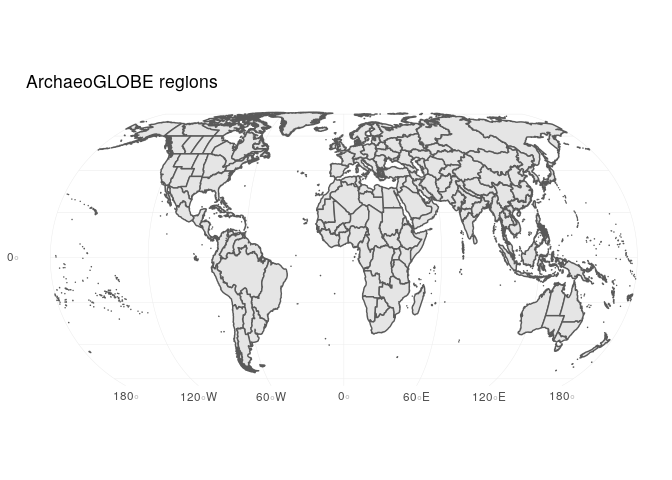
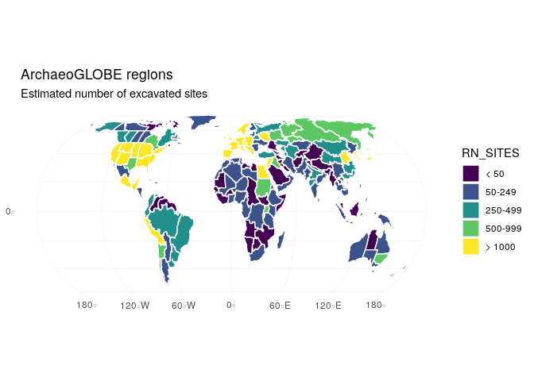

Sample analysis code for the ArchaeoGlobe database.

## Setup
Import packages needed for analysis. We'll use packages from the `tidyverse`, such as `readr`, `dplyr`, and `ggplot2` for data import, processing, and plotting. The `sf` package will help us work with shapefiles in a tidy context.

```r
library(tidyverse)
```

```
## ── Attaching packages ──────────────────────────────────────────────────────────────────────────────────────────── tidyverse 1.2.1 ──
```

```
## ✔ ggplot2 3.0.0.9000     ✔ purrr   0.2.5     
## ✔ tibble  1.4.2          ✔ dplyr   0.7.6     
## ✔ tidyr   0.8.1          ✔ stringr 1.3.1     
## ✔ readr   1.1.1          ✔ forcats 0.3.0
```

```
## ── Conflicts ─────────────────────────────────────────────────────────────────────────────────────────────── tidyverse_conflicts() ──
## ✖ dplyr::filter() masks stats::filter()
## ✖ dplyr::lag()    masks stats::lag()
```

```r
library(sf)
```

```
## Linking to GEOS 3.6.2, GDAL 2.2.3, proj.4 4.9.3
```

## Data import
Read in the latest version of the ArchaeoGLOBE database.

```r
dat <- read_csv('../data/ArchaeoGLOBE_Public_Data_2018_08_14.csv') %>%
  filter(RN_SITES != '17899')
```

```
## Parsed with column specification:
## cols(
##   .default = col_character(),
##   WORLD_ID = col_integer(),
##   REGION_ID = col_integer(),
##   TOT_AREA = col_double(),
##   LAND_AREA = col_double()
## )
```

```
## See spec(...) for full column specifications.
```

Take a closer look at the database to make sure all is well.

```r
glimpse(dat)
```

```
## Observations: 702
## Variables: 78
## $ RESPONS_ID <chr> "RTDEL", "RZCHA", "RRSIS", "RDTVQ", "RATEQ", "RIJZG...
## $ WORLD_ID   <int> 1, 1, 1, 1, 1, 1, 1, 1, 1, 1, 1, 1, 1, 1, 1, 1, 1, ...
## $ WORLD_LAB  <chr> "Northern North America + Greenland", "Northern Nor...
## $ REGION_ID  <int> 1, 1, 1, 1, 1, 1, 1, 2, 2, 2, 3, 3, 4, 4, 4, 5, 5, ...
## $ REGION_LAB <chr> "Alaska", "Alaska", "Alaska", "Alaska", "Alaska", "...
## $ TOT_AREA   <dbl> 1499260, 1499260, 1499260, 1499260, 1499260, 149926...
## $ LAND_AREA  <dbl> 1492600, 1492600, 1492600, 1492600, 1492600, 149260...
## $ RN_SITES   <chr> "500-999", "250-499", "250-499", "50-249", "> 1000"...
## $ EXP_10000  <chr> "Low", "High", "High", "High", "High", "High", "Low...
## $ EXP_08000  <chr> "High", "High", "High", "High", "High", "High", "Lo...
## $ EXP_06000  <chr> "High", "High", "Low", "High", "High", "Low", "Low"...
## $ EXP_04000  <chr> "High", "Low", "Low", "High", "High", "Low", "Low",...
## $ EXP_03000  <chr> "High", "Low", "Low", "High", "High", "Low", "Low",...
## $ EXP_02000  <chr> "High", "Low", "Low", "High", "High", "None", "Low"...
## $ EXP_01000  <chr> "High", "Low", "Low", "High", "High", "None", "Low"...
## $ EXP_00500  <chr> "High", "Low", "Low", "High", "Low", "None", "Low",...
## $ EXP_00250  <chr> "High", "Low", "Low", "High", "Low", "None", "Low",...
## $ EXP_00150  <chr> "High", "Low", "Low", "High", "Low", "None", "Low",...
## $ DQ_10000   <chr> "Good", "Moderate", "Moderate", "Good", "Good", "Mo...
## $ DQ_08000   <chr> "Good", "Unknown", "Moderate", "Good", "Good", "Mod...
## $ DQ_06000   <chr> "Good", "Unknown", "Moderate", "Good", "Good", "Mod...
## $ DQ_04000   <chr> "Good", "Moderate", "Moderate", "Good", "Good", "Mo...
## $ DQ_03000   <chr> "Good", "Moderate", "Moderate", "Good", "Good", "Mo...
## $ DQ_02000   <chr> "Good", "Moderate", "Good", "Good", "Good", "Good",...
## $ DQ_01000   <chr> "Good", "Moderate", "Good", "Good", "Good", "Good",...
## $ DQ_00500   <chr> "Good", "Moderate", "Good", "Good", "Good", "Good",...
## $ DQ_00250   <chr> "Good", "Moderate", "Good", "Good", "Good", "Good",...
## $ DQ_00150   <chr> "Good", "Moderate", "Good", "Good", "Good", "Good",...
## $ HUNT_10000 <chr> "widespread (>20%)", "widespread (>20%)", "widespre...
## $ EXAG_10000 <chr> "none", "none", "none", "none", "none", "none", "no...
## $ INAG_10000 <chr> "none", "none", "none", "none", "none", "none", "no...
## $ PAST_10000 <chr> "none", "none", "none", "none", "none", "none", "no...
## $ HUNT_08000 <chr> "widespread (>20%)", "widespread (>20%)", "widespre...
## $ EXAG_08000 <chr> "none", "none", "none", "none", "none", "none", "no...
## $ INAG_08000 <chr> "none", "none", "none", "none", "none", "none", "no...
## $ PAST_08000 <chr> "none", "none", "none", "none", "none", "none", "no...
## $ HUNT_06000 <chr> "widespread (>20%)", "widespread (>20%)", "widespre...
## $ EXAG_06000 <chr> "none", "none", "none", "none", "none", "none", "no...
## $ INAG_06000 <chr> "none", "none", "none", "none", "none", "none", "no...
## $ PAST_06000 <chr> "none", "none", "none", "none", "none", "none", "no...
## $ HUNT_04000 <chr> "widespread (>20%)", "widespread (>20%)", "widespre...
## $ EXAG_04000 <chr> "none", "none", "none", "none", "none", "none", "no...
## $ INAG_04000 <chr> "none", "none", "none", "none", "none", "none", "no...
## $ PAST_04000 <chr> "none", "none", "none", "none", "none", "none", "no...
## $ HUNT_03000 <chr> "widespread (>20%)", "widespread (>20%)", "widespre...
## $ EXAG_03000 <chr> "none", "none", "none", "none", "none", "none", "no...
## $ INAG_03000 <chr> "none", "none", "none", "none", "none", "none", "no...
## $ PAST_03000 <chr> "none", "none", "none", "none", "none", "none", "no...
## $ HUNT_02000 <chr> "widespread (>20%)", "widespread (>20%)", "widespre...
## $ EXAG_02000 <chr> "none", "none", "none", "none", "none", "none", "no...
## $ INAG_02000 <chr> "none", "none", "none", "none", "none", "none", "no...
## $ PAST_02000 <chr> "none", "none", "none", "none", "none", "none", "no...
## $ HUNT_01000 <chr> "widespread (>20%)", "widespread (>20%)", "widespre...
## $ EXAG_01000 <chr> "none", "none", "none", "none", "none", "none", "no...
## $ INAG_01000 <chr> "none", "none", "none", "none", "none", "none", "no...
## $ PAST_01000 <chr> "none", "none", "none", "none", "none", "none", "no...
## $ HUNT_00500 <chr> "widespread (>20%)", "widespread (>20%)", "widespre...
## $ EXAG_00500 <chr> "none", "none", "none", "none", "none", "none", "no...
## $ INAG_00500 <chr> "none", "none", "none", "none", "none", "none", "no...
## $ PAST_00500 <chr> "none", "none", "none", "none", "none", "none", "no...
## $ HUNT_00250 <chr> "widespread (>20%)", "widespread (>20%)", "widespre...
## $ EXAG_00250 <chr> "none", "none", "none", "none", "none", "none", "no...
## $ INAG_00250 <chr> "none", "none", "none", "none", "none", "none", "no...
## $ PAST_00250 <chr> "none", "none", "none", "none", "none", "none", "mi...
## $ HUNT_00150 <chr> "widespread (>20%)", "widespread (>20%)", "widespre...
## $ EXAG_00150 <chr> "minimal (<1%)", "none", "none", "minimal (<1%)", "...
## $ INAG_00150 <chr> "minimal (<1%)", "minimal (<1%)", "minimal (<1%)", ...
## $ PAST_00150 <chr> "minimal (<1%)", "minimal (<1%)", "minimal (<1%)", ...
## $ URBN_10000 <chr> "Absent", "Absent", "Absent", "Absent", "Absent", "...
## $ URBN_08000 <chr> "Absent", "Absent", "Absent", "Absent", "Absent", "...
## $ URBN_06000 <chr> "Absent", "Absent", "Absent", "Absent", "Absent", "...
## $ URBN_04000 <chr> "Absent", "Absent", "Absent", "Absent", "Absent", "...
## $ URBN_03000 <chr> "Absent", "Absent", "Absent", "Absent", "Absent", "...
## $ URBN_02000 <chr> "Absent", "Absent", "Absent", "Absent", "Absent", "...
## $ URBN_01000 <chr> "Absent", "Absent", "Absent", "Absent", "Absent", "...
## $ URBN_00500 <chr> "Absent", "Absent", "Absent", "Absent", "Absent", "...
## $ URBN_00250 <chr> "Absent", "Absent", "Absent", "Absent", "Absent", "...
## $ URBN_00150 <chr> "Absent", "Present", "Present", "Absent", "Present"...
```

Next import the regions shapefile.

```r
regions <- st_read('../data/ArchaeGLOBE_Regions.shp')
```

```
## Reading layer `ArchaeGLOBE_Regions' from data source `/home/nick/gdrive/Projects/ArchaeoGLOBE/data/ArchaeGLOBE_Regions.shp' using driver `ESRI Shapefile'
## Simple feature collection with 146 features and 6 fields
## geometry type:  MULTIPOLYGON
## dimension:      XY
## bbox:           xmin: -16653410 ymin: -6637605 xmax: 16821760 ymax: 8375497
## epsg (SRID):    NA
## proj4string:    +proj=eck4 +lon_0=0 +x_0=0 +y_0=0 +datum=WGS84 +units=m +no_defs
```

Take a closer look.

```r
glimpse(regions)
```

```
## Observations: 146
## Variables: 7
## $ World_ID   <dbl> 1, 1, 1, 1, 1, 1, 1, 1, 1, 1, 1, 1, 1, 2, 2, 2, 2, ...
## $ World_RG   <fct> Northern North America and Greenland, Northern Nort...
## $ Archaeo_ID <dbl> 1, 2, 3, 4, 5, 6, 7, 8, 9, 10, 11, 12, 13, 14, 15, ...
## $ Archaeo_RG <fct> Alaska, Yukon Territory, Northwest Territories, Nun...
## $ Total_Area <dbl> 1499260, 482548, 1342540, 2069700, 943566, 662254, ...
## $ Land_Area  <dbl> 1492600, 482179, 1277000, 2056380, 940882, 658381, ...
## $ geometry   <MULTIPOLYGON [m]> MULTIPOLYGON (((-14146171 6..., MULTIP...
```


## Plotting
Next let's explore some sample plots

```r
ggplot() + 
  geom_sf(data = regions) +
  theme_minimal() +
  ggtitle('ArchaeoGLOBE regions')
```

<!-- -->

Next try plotting the estimated number of sites. First define an ordering for the number of sites estimate, to aid in plotting.

```r
n_sites <- c('< 50', '50-249', '250-499', '500-999', '> 1000')
```

Now, modify the `RN_SITES` column to be an ordered factor using the above sequence. Then calculate the most common response for each region, and plot the result

```r
dat %>% 
  select(REGION_ID, RN_SITES) %>% # just select the columns of interest
  mutate(RN_SITES = ordered(RN_SITES, levels = n_sites)) %>% # create an ordered factor
  group_by(REGION_ID) %>% # focus on each region separately
  count(RN_SITES) %>% # count the number of responses for each site number
  slice(which.max(n)) %>% # choose the most selected response for each region
  left_join(regions, ., by = c('Archaeo_ID' = 'REGION_ID')) %>% # join to the region shapes
  ggplot() + # plot
    geom_sf(aes(fill = RN_SITES), color = 'white') +
    theme_minimal() +
    ggtitle('ArchaeoGLOBE regions', 'Estimated number of excavated sites')
```

<!-- -->

